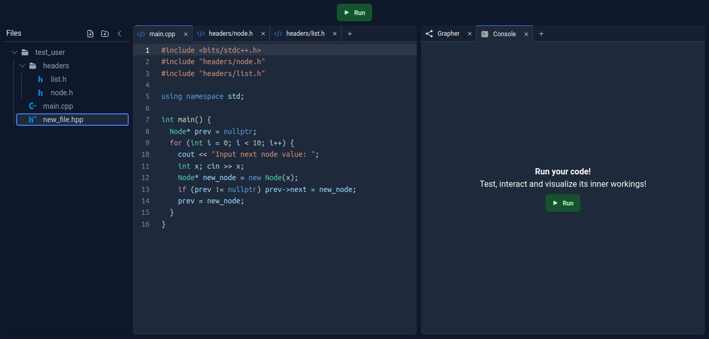
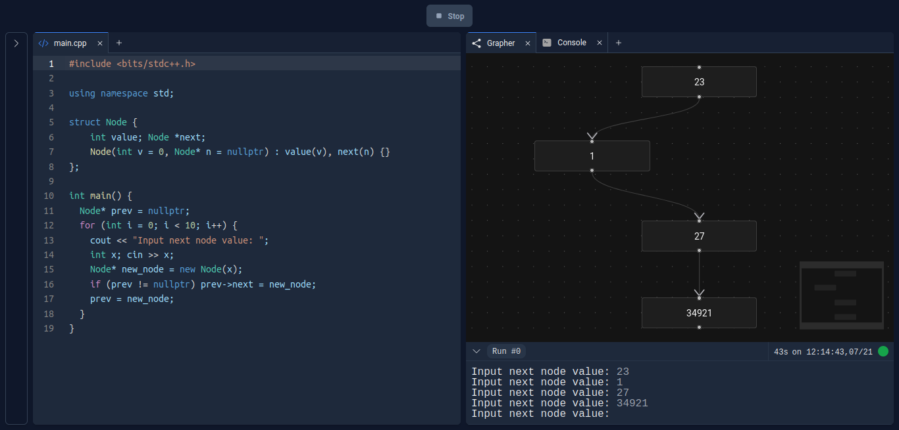

# Code Visualizer

	

Code Visualizer is an online coding platform for data structures and algorithms students to practice coding basic data structures like linked lists and trees and visually see what their code is doing step by step, making understanding complex algorithmic concepts and debugging code significantly easier and giving students a tangible way of sensing what their code does apart from just simple text on a screen.

The project is publicaly avaiable to try here [coming soon]!

## Interface

The platform has an expandable filetree to the left which allows for file and folder structure creation, viewing, deletion and manipulation. Different files can be opened and edited in the left pane and the right pane contains the grapher and the console where the project can be run and visualized!

	

Below is a sample test for a simple code that creates a chain of nodes (a linked list)!

	

### Development

The platform's design is inspired by Replit, and the platform was developed with React, Node and Express, and the graphing library used is React-flow (credits to them for the amazing library).
